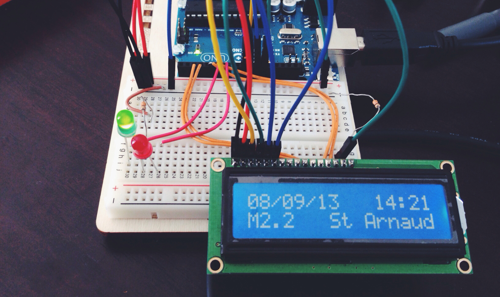
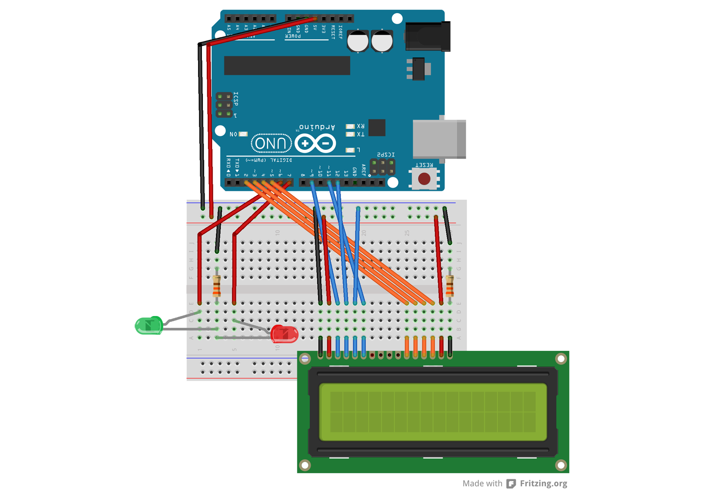

# Quake Update

This is a small weekend project using Arduino and Processing. It retrieves the latest item in RSS feed from geonet.org.nz, formats the data and dipslay it on an LCD that is connected to an Arduino board. 

## Display

There are 2 LEDs – green and red. The red LED is turned on for a certain amount of time when the latest update's magnitute is over 4.0. Otherwise, the green LED is turned on for the same amount of time. 

On the LCD, there are 4 fields to display:

 - Date (DD/MM/YYYY)
 - Time (hh:mm)
 - Magnitute
 - Location

## Electronic Components

To see what electronic components are used and connects, refer to *breadboard.fzz* file. Download the tool from [Fritzing](http://fritzing.org).

